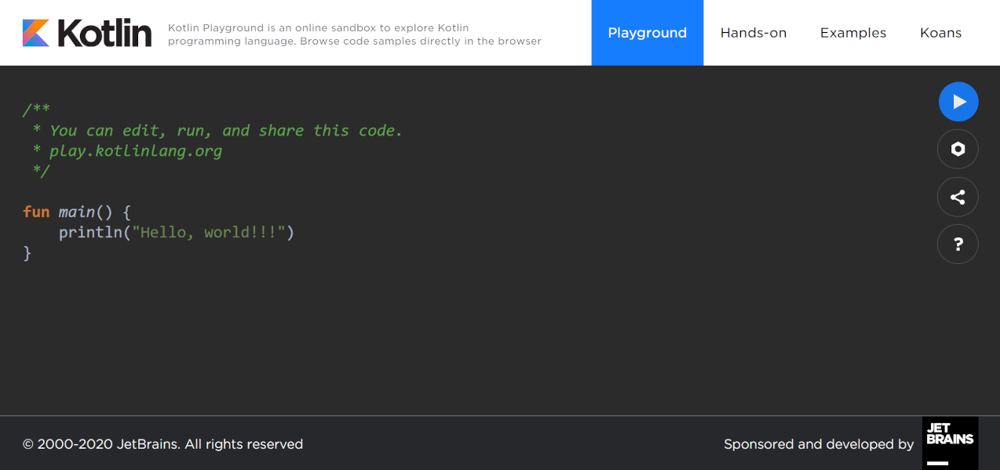

[Etusivu](README.md) | [Osa 1](osa-1.md) | [Osa 2](osa-2.md) | [Osa 3](osa-3.md) | [Osa 4](osa-4.md) | [Osa 5](osa-5.md)

# Osa 1: Tulostaminen

## Oppimistavoitteet

- Tutustut Kotlin-hiekkalaatikkoon.
- Opit kirjoittamaan Kotlin-ohjelman, joka tulostaa tekstiä.
- Tutustut ohjelman suorittamiseen Kotlin-hiekkalaatikossa.
- Osaat tulkita ja korjata ohjelman suorittamisessa aiheutuneita yksinkertaisia virheitä.

Tietokoneohjelmat, puhelimen sovellukset tai selaimen kautta toimivat sovellukset näyttävät monenlaisia viestejä käyttäjälle. Esimerkiksi mobiilisovellus voi vaatia sisäänkirjautumisen, ja jos käyttäjä kirjoittaa salasanansa väärin, mobiilisovellus näyttää käyttäjälle virheilmoituksen puhelimen näytöllä.

[Kotlin-ohjelmointikielessä](https://kotlinlang.org/) tekstiä tulostetaan näytölle komennolla *print*:

```kotlin
print("Hei!")
```

Kotlinilla tehdyt ohjelmat vaativat toimiakseen ohjelmarungon, joka näyttää seuraavalta:

```kotlin
fun main() {
  print("Hei maailma!")
}
```

Ohjelman suoritus alkaa riviä *fun main() {*
seuraavalta riviltä ja päättyy sulkevaan aaltosulkuun }. Ohjelmarungon sisällä olevat komennot suoritetaan yksi kerrallaan. Yllä olevassa ohjelmassa on vain yksi komento: *print("Hei maailma!")* ja komento tulostaa näytölle tulosteen:

```text
Hei maailma!
```

Huomaa, että toisin kuin useimmissa ohjelmointikielissä, Kotlin ei edellytä komentojen päättyvän puolipisteeseen. Puolipisteen lisäämisestä ei myöskään aiheudu virhettä. Puolipiste kuitenkin tarvitaan, jos samalla rivillä on useampi komento:

```kotlin
fun main() {
    print("Hei "); print("maailma!")
}
```

Tämä ei kuitenkaan ole kovin luettavaa koodia. Yleensä jokainen komento kirjoitetaan ohjelmakoodissa omalle rivilleen.

Komennolla println tulostetaan näytölle tekstiä, ja sen jälkeen rivinvaihto:

```kotlin
println("Hei")
println("maailma!")
```

Seuraava ohjelma tulostaa näytölle tekstin "Hei maailma!" sekä perään rivinvaihdon:

```kotlin
fun main() {
    println("Hei maailma!")
}
```

Yllä oleva ohjelmakoodi on itseasiassa valmis ohjelma. Ohjelmakoodin lisäksi tarvitaan kuitenkin aina jonkinlainen ohjelmointiympäristö tai hiekkalaatikko, jossa ohjelma voidaan käynnistää eli ajaa. [Kotlin Playground](https://play.kotlinlang.org/) on verkossa toimiva niin sanottu hiekkalaatikko-ympäristö, jonka avulla voit tutkia ja harjoitella Kotlin-ohjelmointikielen perusteita ilman erillisen ohjelmointiympäristön asennusta tai tunnuksen luomista. Kotlin-hiekkalaatikossa voit ajaa turvallisesti koodinpätkiä sekä pieniä Kotlin-ohjelmia. Lisäksi voit selata koodinäytteitä suoraan selaimessa.



Seuraavissa tehtävissä harjoittelet hiekkalaatikossa näytölle tulostamista.

## Tehtävät

&nbsp;&nbsp;&nbsp;&nbsp;&nbsp;&nbsp;&nbsp;&nbsp;&nbsp;&nbsp;**Perustehtävät**

1.1 Mene selaimella Kotlin-hiekkalaatikkoon osoitteeseen [https://play.kotlinlang.org/](https://play.kotlinlang.org/) Käynnistä eli aja hiekkalaatikossa näkyvä valmis koodi painamalla oikean laidan play-painiketta. Mitä ohjelma tulostaa?
Lisää print-lauseen perään puolipiste ja aja ohjelma uudelleen. Mitä ohjelma tulostaa?

1.2 Muokkaa tulostusta siten, että ohjelma tulostaa koko nimesi.

1.3 Muokkaa tulostusta siten, että ohjelma tulostaa ensimmäiselle riville ”Hei” ja toiselle riville nimesi.

1.4 Alla olevassa ohjelmassa on virhe:

   ```kotlin
   fun main() {
       println("Ohjelmoidaan") print("Kotlinilla!")
   }
   ```

   Kopioi ja liitä ohjelmakoodi Kotlin-hiekkalaatikkoon. Korjaa ohjelmakoodia ja aja ohjelma siten, että se tulostaa tekstin kahdelle riville:

   ```text
   Ohjelmoidaan
   Kotlinilla!
   ```

   **Guru-tehtävä**

1.5 Alla olevassa ohjelmassa on virhe:

   ```kotlin
   fun main() {
       println("Kotlin-ohjelmointi on hauskaa ja helppoa!
   }
   ```

   Aja ohjelma Kotlin-hiekkalaatikossa ja korjaa virheet hiekkalaatikon antamien virheilmoitusten mukaan.

Kun olet saanut osan 1 tehtävät tehtyä, voit siirtyä [osaan 2](osa-2.md).
