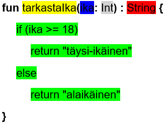

[Tietoa kurssista](README.md) | [Osa 1](osa-1.md) | [Osa 2](osa-2.md) | [Osa 3](osa-3.md) | [Osa 4](osa-4.md) | [Osa 5](osa-5.md) | [Yhteenveto](yhteenveto.md) | [Malliratkaisut](malliratkaisut/malliratkaisut.md) | [FAQ](faq.md) | [Sanasto](sanasto.md)

# Osa 5: Funktiot

## Oppimistavoitteet

- Tunnet käsitteet funktio, funktion parametri, funktion paluuarvo ja funktion oletusarvo.
- Osaat luoda pala palalta erilaisia parametrillisia ja parametrittomia funktioita.
- Osaat luoda funktioita, jotka palauttavat arvon.
- Osaat kutsua funktioita sekä pääohjelmasta että muiden funktioiden sisältä.

Tietokoneohjelmien ja erilaisten sovellusten kaikki toiminnallinen koodi kirjoitetaan funktioihin. Jokaisen ohjelman lähdekoodista löytyy aina vähintäänkin main-funktio, jonka avulla ohjelma käynnistetään. Tätä kutsutaan yleensä pääohjelmaksi. Tämän kurssin ensimmäisessä osassa opimme, että Kotlinilla tehdyt ohjelmat vaativat toimiakseen ohjelmarungon, joka näyttää seuraavalta:

```kotlin
fun main() {
   // Tähän tulee koodi, jolla ohjelma käynnistetään
}
```

Tämä ohjelmarunko on itseasiassa funktio. Kotlinissa funktiot määritellään *fun*-avainsanan avulla. Avainsanaa seuraa aina funktion nimi, jonka perässä on tavalliset sulkeet. Funktion sisältämä koodi kirjoitetaan aina aaltosulkeiden sisään. Yllä oleva funktio ei sisällä koodia, ainoastaan kommenttimerkin. Voimme lisätä funktioon koodia:

```kotlin
fun main() {
   print("Hei koodari")
}
```

Nyt main-funktio tulostaa tekstin *Hei koodari* Kotlin-ohjelmointikielen valmiin *print*-funktion avulla. Kotlinissa on useita valmiita funktioita, joita ohjelmoija voi käyttää hyödykseen. Ohjelmoija voi myös kirjoitaa omia funktioita, joten katsotaanpa seuraavaksi miten funktioita kirjoitetaan eli määritellään Kotlinissa.

## Funktion osat

Ohjelmakoodissa olevat funktiot voivat suorittaa monenlaisia toimintoja tai laskea ja palauttaa jonkin arvon. Jotta funktio toimisi ja sitä voidaan kutsua muualta koodista, tulee funktio määritellä. Funktiossa on neljä tärkeää osaa:

- funktion nimi
- parametrit ja niiden tyypit
- paluuarvon tyyppi sekä
- varsinainen funktion sisältämä koodi.

Funktion runko näyttää siis seuraavalta:

```kotlin
fun funktionNimi(parametri: parametrinTyyppi): paluuarvonTyyppi {
   // funktion sisältämä koodi
}
```

Pureudutaan seuraavaksi funktiorungon osiin hieman tarkemmin. Jokaisella funktiolla tulee olla nimi. Kotlinissa funktiot nimetään ns. *camelCase*-tyylin avulla siten, että ensimmäinen sana kirjoitetaan pienellä ja loput alkavat isolla alkukirjaimella:

```kotlin
fun lisaaYksi() {

}
```

Seuraavaksi funktioon määritellään sen mahdollisesti käyttämät parametrit. Parametrit ovat funktiolle annettavia arvoja, joita käytetään funktion suorituksessa. Funktion parametrit määritellään funktion nimen jälkeen olevien sulkujen sisällä. Parametrista annetaan parametrin nimi ja parametrin tyyppi kaksoispisteellä erotettuna. Seuraavassa esimerkissä lisaaYksi-funktiolle on annettu yksi parametri, *Int*-tyyppinen parametri *luku*:

```kotlin
fun lisaaYksi(luku: Int) {

}
```

Seuraavaksi funktioon määritellään sen mahdollisesti palauttaman arvon tyyppi. Funktiot voivat palauttaa arvoja sille ohjelmanosalle, jossa funktiota kutsuttiin. Tällöin paluuarvon tyyppi tulee olla määriteltynä funktioon, jotta kutsuva ohjelmanosa osa käsitellä saamaansa dataa oikein. Seuraavassa esimerkissä lisaaYksi-funktiolle on annettu paluuarvon tyypiksi kokonaisluku (*Int*). Funktio siis palauttaa kokonaisluvun.

```kotlin
fun lisaaYksi(luku: Int): Int {

}
```

Lopuksi funktiolle lisätään koodi, joka funktion tulee suorittaa. Funktion lähdekoodi kirjoitetaan aaltosulkeiden eli lohkon sisälle. Lähdekoodi voi sisältää esimerkiksi muuttujia, ehto- tai valintalauseita, toistolauseita tai kutsuja muihin funktioihin. Seuraavassa esimerkissä lisaaYksi-funktiolle on kirjoitettu lähdekoodi, jossa parametrissa annetusta luvusta luodaan uusi luku lisäämällä lukuun yksi. Lopuksi uusi luku palautetaan funktion paluuarvona *return*-avainsanan avulla:

```kotlin
fun lisaaYksi(luku: Int): Int {
   val uusiLuku = luku + 1
   return uusiLuku
}
```

Nyt funktio palauttaa parametrina annetun luvun lisättynä yhdellä. Sama funktio voitaisiin kirjoittaa vielä yksinkertaisemmin:

```kotlin
fun lisaaYksi(luku: Int): Int {
   return luku + 1
}
```

Funktion ei tarvitse välttämättä palauttaa mitään arvoa. Funktioon ei myöskään välttämättä tarvitse määritellä parametreja. Seuraava on esimerkki funktiosta, jossa ei ole mitään parametreja eikä se palauta mitään arvoa:

```kotlin
fun tulosta() {
    print("Hei!")
}
```

Funktioita siis kirjoitetaan pala palalta. Yleensä yksi funktio hoitaa vain yhtä asiaa, eli esimerkiksi jonkun arvon laskemista, arvon tarkastamista, arvon muokkaamista tai tulostamista.

## Funktion kutsuminen

Funktiota kutsutaan kirjoittamalla ohjelmanosaan (esimerkiksi main-funktioon) funktion nimi sekä antamalla sille funktion mahdollisesti vaatimat parametrit. Yllä olevaa esimerkkifunktiota voidaan kutsua pääohjelmassa seuraavasti:

```kotlin
fun main() {
   val luku = 10
   val paluuarvo = lisaaYksi(luku)
   print("Uusi luku on " + paluuarvo)
}
```

Esimerkissä määritellään ensin kokonaislukutyyppinen luku-muuttuja, jonka arvo on 10. Seuraavaksi kutsutaan lisaaYksi-funktiota siten, että funktion palauttama kokonaislukuarvo otetaan talteen paluuarvo-nimiseen muuttujaan. Lopuksi saatu arvo tulostetaan näytölle.

Funktioita voidaan kutsua myös toisesta funktiosta. Muistamme, että Kotlinissa myös pääohjelma on funktio, joten siinä kutsutaan usein funktiota funktion sisällä. Seuraavassa esimerkissä main-funktiossa kutsutaan valmista print-funktiota:

```kotlin
fun main() {
   print("Hei koodari")
}
```

Myös itse tehdystä funktiosta voidaan kutsua joko Kotlinin valmiita funktioita tai muita itse tehtyjä funktioita. Seuraavassa esimerkissä main-funktiosta kutsutaan itse tehtyä tulostaTulos-funktiota. TulostaTulos funktiossa kutsutaan valmista *print*-funktiota, sekä itse tehtyä laskeSumma-funktiota.

```kotlin
fun laskeSumma(a: Int, b: Int) : Int {
    return a + b
}

fun tulostaTulos() {
    print("Summa on " + laskeSumma(1, 2))
}

fun main() {
    tulostaTulos()
}
```

## Funktion oletusarvo

Kotlinissa funktion parametreillä voi olla oletusarvoja, joita käytetään silloin, kun funktiota kutsutaan ilman annettua parametria. Funktion oletusarvo määritellään funktion parametrin tyypin jälkeen yhtäsuuruus-merkin avulla:

```kotlin
fun tulosta(tervehdys: String = "Hei!") = println(tervehdys)
```

Nyt yllä olevaa funktiota voidaan kutsua parametrin avulla tai ilman parametria, jolloin tulostetaan oletusarvo. Seuraavat funktiokutsut:

```kotlin
tulosta()
tulosta("Hello!")
tulosta("Hola!")
```

tulostavat:

```
Hei!
Hello!
Hola!
```

## Lauseke funktion sisältönä

Kotlinissa on lisäksi mahdollisuus kirjoittaa funktiot vieläkin tiiviimmin silloin, kun funktio on yksinkertainen. Funktio voidaan kirjoittaa pelkkänä lausekkeena, ilman funktion paluuarvon tyyppiä, return-lausetta ja lohkon merkkaavia kaarisulkeita. Näin koodista saadaan tiiviimpää, kun kaikki "ylimääräinen" saadaan poistettua. Funktion osat näyttävät tällöin esimerkiksi seuraavalta:


Funktion sisältönä voi siis olla esimerkiksi Osiossa 3 esitelty jos-ehtolause. Ajatellaan, että haluaisimme koostaa funktion seuraavista palasista:


Normaalisti pidemmässä muodossa kirjoitettuna funktio näyttäisi tältä:



Funktion sisältö voidaan kuitenkin siis kirjoittaa lausekkeen avulla ilman funktion paluuarvon tyyppiä, return-lauseita ja funktion lohkon merkkaavia kaarisulkeita. Tällöin funktio näyttäisi seuraavanlaiselta:


Yllä olevassa esimerkissä jos-ehtolauseen arvo sijoitetaan funktion paluuarvoksi. Kotlin-kääntäjä päättelee funktion palauttavan paluuarvon tyypin itse ajon aikana, koska sitä ei tarvitse kirjoittaa näkyviin. Tässä tapauksessa paluuarvon tyyppinä on merkkijono. Esimerkin funktio tarkastaa parametrinä annetun ika-muuttujan, ja palauttaa merkkijonon "täysi-ikäinen" iän ollessa 18 tai enemmän, muuten merkkijonon "alaikäinen".

Huomaa, että yllä oleva funktio vie tilaa vain yhden koodirivin pidemmän muodon kuuden rivin sijaan. Ohjelmakoodia saa siten hyvin tiivistettyä käyttämällä lausekkeita funktion sisältönä.

Samaan tapaan myös osiossa 3 esitellyn kun-valintalauseen palauttama lauseke voi olla funktion sisältönä:

```kotlin
fun kokonaisluvunArvoMerkkijonona(x: Int) = when {
   x < 0 -> "negatiivinen"
   x == 0 -> "nolla"
   else -> "positiivinen"
}
```

## Yhteenveto

Tässä kurssin osassa käsiteltiin funktioita. Tutustuimme käsitteisiin funktion parametri, funktion paluuarvo ja funktion oletusarvo. Lisäksi tutustuimme funktion osiin sekä parametrittomiin ja parametrillisiin funktioihin. Opettelimme myös kutsumaan erilaisia funktioita. Seuraavissa tehtävissä harjoittelet funktion toiminnan selvittämistä, funktiossa olevien virheiden korjaamista sekä funktion kirjoittamista aivan alusta alkaen.

## Tehtävät

&nbsp;&nbsp;&nbsp;&nbsp;&nbsp;&nbsp;&nbsp;&nbsp;&nbsp;&nbsp;**Perustehtävät**

5.1 Mitä seuraava funktio tekee?

   ```kotlin
   fun omaLaskuri() {
      var tulo = 1;
      for (luku in 1..5) {
         tulo = tulo * luku
      }
      print(tulo)
   }
   ```

5.2 Mitä seuraava funktio tekee?

   ```kotlin
   fun laske(luku: Int, toinenLuku: Int) : Int {
      if (luku > toinenLuku) {
         return luku - toinenLuku
      } else if (toinenLuku > luku) {
         return toinenLuku - luku
      }
      return 0
   }
   ```

5.3 Mitä seuraava funktio tekee?

   ```kotlin
   fun muuta(nimi: String = "tuntematon") = nimi.capitalize()
   ```

5.4 Mene selaimella Kotlin-hiekkalaatikkoon osoitteeseen [https://play.kotlinlang.org/](https://play.kotlinlang.org/) Kopioi seuraava ohjelmakoodi hiekkalaatikkoon

   ```kotlin
   fun toinenOmaFunktio(x: Int) : Int {
      return x * 2
   }

   fun omaFunktio(y: Int) {
      for (x in 1..3) {
         println(toinenOmaFunktio(y))
      }
   }

   fun main() {
      toinenOmaFunktio(5)
   }
   ```

   ja korjaa ohjelmaa siten, että ohjelma tulostaa luvun 10 kolme kertaa allekkain.

5.5 Kopioi seuraava ohjelmakoodi hiekkalaatikkoon

   ```kotlin
   fun laske(a: Int, b: Int) {
      val tulos = a + b
   }

   fun main() {
      val a = 10
      val b = 4
      val erotus = laske(a, b)
      print("Lukujen " + a + " ja " + b + " erotus on " + erotus + ".")
   }
   ```

   ja korjaa funktiota siten, että ohjelma tulostaa tekstin *Lukujen 10 ja 4 erotus on 6.*

5.6 Kirjoita funktio, joka ei saa mitään parametreja ja joka laskee ja tulostaa kaikki kolmella jaolliset luvut väliltä -30...30

5.7 Kirjoita funktio, joka saa parametrinaan kaksi kokonaislukua ja joka tulostaa näiden osamäärän tai 0, jos jakaja on nolla.

5.8 Kirjoita funktio, joka palauttaa parametrinaan saamistaan kahdesta kokonaisluvusta suurimman.

5.9 Kirjoita funktio, joka tarkasta oliko parametrina saatu luku positiviinen. Jos oli, funktio palauttaa merkkijonon "positiivinen". Jos luku oli 0, funktio palauttaa merkkijonon "nolla". Muutoin palauttaa merkkijonon "negatiivinen".

&nbsp;&nbsp;&nbsp;&nbsp;&nbsp;&nbsp;&nbsp;&nbsp;&nbsp;&nbsp;**Guru-tehtävä**

5.10 Kirjoita funktio, joka saa parametrinaan kolme kokonaislukua satunnaisessa järjestyksessä ja joka tulostaa luvuista pienimmän.

Hienoa! Nyt olet suorittanut kurssin loppuun.

> (c) Teija Alasalmi 2021

> Kurssimateriaalin käyttäminen kaupallisiin tarkoituksiin tai opetusmateriaalina ilman lupaa on ehdottomasti kielletty!